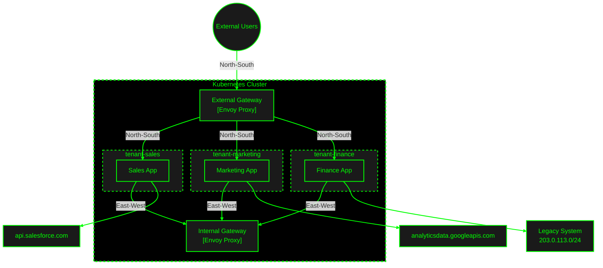

The widespread adoption of Kubernetes has revolutionized application deployment and management, enabling unprecedented scalability and flexibility. This often leads to scenarios where multiple teams or applications share the same Kubernetes cluster, a concept known as multi-tenancy. While offering numerous benefits, multi-tenancy introduces significant challenges, like network isolation, storage isolation, node isolation, API server priority and fairness, and mitigating "noisy neighbor" issues. Among these, network isolation and controlled communication between different tenants or applications often emerge as the most crucial concerns for organizations, primarily because an unsegmented network can lead to unauthorized access to sensitive data and allow lateral movement for attackers, thereby compromising the confidentiality and integrity of tenant workloads.

By default, Kubernetes allows open communication between pods, regardless of their namespace. This can lead to potential security vulnerabilities in environments where multiple tenants or applications share the same cluster. The challenge lies in establishing robust network boundaries and regulating inter-namespace traffic while still facilitating necessary interactions between services. In this blog, we will explore how we can leverage Envoy Gateway along with Cilium to establish robust network boundaries and regulate north south and east west traffic based on application level and network level policies.

## Cilium Network Policies for Network Microsegmentation

Microsegmentation in Kubernetes involves creating isolated network segments within a cluster, enabling granular control over network traffic and enhancing security. Let us explore how we can implement Cilium network policies that, by default deny all inter-namespace traffic, effectively creating strong isolation boundaries around each tenant. For instance, a policy can be applied to a specific namespace to ensure that no pods within it can initiate connections to pods in other namespaces, and no external pods (from other namespaces) can connect to its pods.

```yaml
apiVersion: "cilium.io/v2"
kind: CiliumNetworkPolicy
metadata:
  # Apply this policy in the specific tenant's namespace
  namespace: tenant-a-ns
  name: allow-tenant-comms-and-dns
  description: "Allows all pod-to-pod communication within this namespace (tenant-a-ns), allows egress to CoreDNS for DNS resolution, and restricts other inter-namespace traffic by default."
spec:
  # endpointSelector: {}
  # An empty endpointSelector selects all pods within the namespace
  # where this policy is applied (i.e., all pods in 'tenant-a-ns').
  endpointSelector: {}

  # Ingress rules: Define what incoming traffic is allowed to the selected pods.
  ingress:
    - fromEndpoints:
        # An empty selector within fromEndpoints here means "allow traffic from
        # any other pod within this same namespace (tenant-a-ns)".
        - {}

  # Egress rules: Define what outgoing traffic is allowed from the selected pods.
  # Egress traffic is allowed if it matches ANY of the rules in this list.
  egress:
    # Rule 1: Allow all egress to other pods within the same namespace.
    - toEndpoints:
        # An empty selector within toEndpoints here means "allow traffic to
        # any other pod within this same namespace (tenant-a-ns)".
        - {}

    # Rule 2: Allow egress to CoreDNS pods in the 'kube-system' namespace for DNS.
    - toEndpoints:
        - matchLabels:
            # This selects pods that have the Kubernetes label 'k8s-app' with the value 'kube-dns'.
            # Cilium uses the 'k8s:' prefix here to refer to standard Kubernetes labels.
            "k8s:k8s-app": "kube-dns"
            # This special label 'io.kubernetes.pod.namespace' is used by Cilium
            # to specify the namespace of the pods to select.
            "k8s:io.kubernetes.pod.namespace": "kube-system"
      toPorts:
        - ports:
            - port: "53"
              protocol: "UDP"
            - port: "53"
              protocol: "TCP"
          # Optional: If you want to implement L7 DNS policy (e.g., restrict to specific domain patterns)
          # you could add a 'rules' section here. For general DNS resolution, L4 is sufficient.
          # rules:
          #   dns:
          #     - matchPattern: "*" # Allows resolution of any domain

  # --- How this restricts other inter-namespace traffic ---
  #
  # If a pod is selected by any CiliumNetworkPolicy, Cilium enforces
  # a 'default deny' posture for traffic not explicitly allowed.
  #
  # Since this policy explicitly allows:
  #   a) all traffic within 'tenant-a-ns'
  #   b) DNS traffic to 'kube-system'
  #
  # All other inter-namespace traffic (both ingress and egress) will be denied,
  # unless other specific policies are created to permit such communication.
```

This policy ensures two key things for pods within a designated tenant namespace (e.g., tenant-a-ns): first, it permits unrestricted communication between any pods residing within that same namespace, facilitating the necessary interactions for the tenant's applications. Second, it explicitly allows these pods to send DNS queries to CoreDNS pods (typically located in the kube-system namespace) on UDP/TCP port 53, which is essential for service discovery and external hostname resolution.

Beyond this baseline, Cilium offers much more granular control. For instance, if you require more fine-grained control over DNS traffic on a per-tenant basis, you can leverage Cilium's L7 DNS-aware policies. This would allow you to specify exactly which domain names or patterns each tenant's pods are permitted to resolve, adding an extra layer of security and preventing unauthorized DNS lookups.

Furthermore, when tenants need to access services or endpoints outside the Kubernetes cluster, such as external databases, APIs, or other cloud services, you can extend this policy. Cilium allows you to define egress rules using toCIDR to permit traffic to specific IP address ranges, or toFQDNs (Fully Qualified Domain Names) to allow traffic to specific external domain names, ensuring that even external communication is explicitly controlled and audited.

Now let us consider a more practical multi-tenant deployment setup where multiple teams deploy their workloads to the same kubernetes cluster. Let us assume there are 3 teams in this organization; sales, marketing and finance. Sales team needs to access salesforce via APIs and marketing team needs to access Google Analytics via APIs and the finance team needs to access their legacy system running in the on premise data center via 203.0.113.10. Following are the relevant Cilium Network Policies for this scenario.

<div class="tabs">
  <div class="tab-buttons">
    <button class="tab-button active" onclick="openTab(event, 'sales-tab')">Sales Team</button>
    <button class="tab-button" onclick="openTab(event, 'marketing-tab')">Marketing Team</button>
    <button class="tab-button" onclick="openTab(event, 'finance-tab')">Finance Team</button>
  </div>

<div id="sales-tab" class="tab-content active">
<pre><code class="language-yaml">
apiVersion: "cilium.io/v2"
kind: CiliumNetworkPolicy
metadata:
  namespace: tenant-sales
  name: default
spec:
  endpointSelector: {}
  ingress:
    - fromEndpoints:
        - {}
  egress:
    - toFQDNs:
        - matchName: "api.salesforce.com"
      toPorts:
        - ports:
            - port: "443"
              protocol: "TCP"
    - toEndpoints:
        - matchLabels:
            "k8s:k8s-app": "kube-dns"
            "k8s:io.kubernetes.pod.namespace": "kube-system"
      toPorts:
        - ports:
            - port: "53"
              protocol: "UDP"
            - port: "53"
              protocol: "TCP"
</code></pre>
</div>

<div id="marketing-tab" class="tab-content">
<pre><code class="language-yaml">
apiVersion: "cilium.io/v2"
kind: CiliumNetworkPolicy
metadata:
  namespace: tenant-marketing
  name: default
spec:
  endpointSelector: {}
  ingress:
    - fromEndpoints:
        - {}
  egress:
    - toFQDNs:
        - matchName: "analyticsdata.googleapis.com"
      toPorts:
        - ports:
            - port: "443"
              protocol: "TCP"
    - toEndpoints:
        - matchLabels:
            "k8s:k8s-app": "kube-dns"
            "k8s:io.kubernetes.pod.namespace": "kube-system"
      toPorts:
        - ports:
            - port: "53"
              protocol: "UDP"
            - port: "53"
              protocol: "TCP"
</code></pre>
</div>

  <div id="finance-tab" class="tab-content">
<pre><code class="language-yaml">
apiVersion: "cilium.io/v2"
kind: CiliumNetworkPolicy
metadata:
  namespace: tenant-finance
  name: default
spec:
  endpointSelector: {}
  ingress:
    - fromEndpoints:
        - {}
  egress:
    - toCIDR:
        - 203.0.113.0/24
      toPorts:
        - ports:
            - port: "443"
              protocol: "TCP"
    - toEndpoints:
        - matchLabels:
            "k8s:k8s-app": "kube-dns"
            "k8s:io.kubernetes.pod.namespace": "kube-system"
      toPorts:
        - ports:
            - port: "53"
              protocol: "UDP"
            - port: "53"
              protocol: "TCP"
</code></pre>
  </div>
</div>

<style>
.tabs {
  margin: 20px 0;
  width: 100%;
  overflow-x: hidden;
}

.tab-buttons {
  display: flex;
  gap: 5px;
  margin-bottom: 10px;
  flex-wrap: wrap;
}

.tab-button {
  padding: 8px 16px;
  border: 1px solid #ddd;
  background: #f8f8f8;
  cursor: pointer;
  border-radius: 4px 4px 0 0;
  flex: 1;
  text-align: center;
  min-width: 120px;
  white-space: nowrap;
  overflow: hidden;
  text-overflow: ellipsis;
}

.tab-button.active {
  background: #fff;
  border-bottom: 1px solid #fff;
  font-weight: bold;
}

.tab-content {
  display: none;
  padding: 20px;
  border: 1px solid #ddd;
  border-radius: 0 4px 4px 4px;
  width: 100%;
  overflow-x: auto;
}

.tab-content.active {
  display: block;
}

@media screen and (max-width: 600px) {
  .tab-buttons {
    flex-direction: column;
    gap: 8px;
  }
  
  .tab-button {
    width: 100%;
    border-radius: 4px;
    margin: 0;
  }
  
  .tab-button.active {
    border-bottom: 1px solid #ddd;
  }
  
  .tab-content {
    border-radius: 4px;
    padding: 15px;
  }
}
</style>

<script>
function openTab(evt, tabName) {
  var i, tabcontent, tabbuttons;
  
  // Hide all tab content
  tabcontent = document.getElementsByClassName("tab-content");
  for (i = 0; i < tabcontent.length; i++) {
    tabcontent[i].classList.remove("active");
  }
  
  // Remove active class from all buttons
  tabbuttons = document.getElementsByClassName("tab-button");
  for (i = 0; i < tabbuttons.length; i++) {
    tabbuttons[i].classList.remove("active");
  }
  
  // Show the current tab and add active class to the button
  document.getElementById(tabName).classList.add("active");
  evt.currentTarget.classList.add("active");
}
</script>

## Gateway Architecture for Secure Traffic Management

With the Cilium network policies in place, we have successfully established strong network boundaries for each tenant, ensuring proper isolation and controlled access to external services. The next crucial step is to facilitate and manage legitimate traffic flows both from outside the cluster (north-south traffic) and between services within the cluster (east-west traffic). To achieve this, we'll implement a dual-gateway architecture using Envoy Gateway: an external gateway for handling incoming traffic from outside the cluster, and an internal gateway for managing service-to-service communication within the cluster. This approach allows us to maintain strict control over traffic patterns while ensuring necessary services remain accessible to authorized consumers.

<p align="center">
  
    <em>Multi-tenant Kubernetes Architecture with Envoy Gateway and Cilium</em>
</p>



The diagram above illustrates our multi-tenant architecture with the following key components:

1. **Tenant Namespaces**: Each team (Sales, Marketing, Finance) has its own isolated namespace with their respective applications.

2. **External Connectivity**:

   - Sales team connects to Salesforce APIs
   - Marketing team connects to Google Analytics APIs
   - Finance team connects to their legacy system (203.0.113.0/24)

3. **Gateway Layer**:

   - External Gateway: Handles north-south traffic (external clients accessing services)
   - Internal Gateway: Manages east-west traffic (inter-service communication between namespaces)

4. **Network Boundaries**: The entire setup runs within a Kubernetes cluster with clear namespace boundaries and controlled communication paths.
