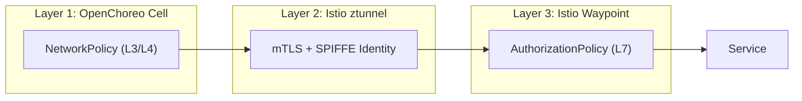

How OpenChoreo Cell architecture and Istio ambient mesh create defense-in-depth for Kubernetes workloads, demonstrated with a simulated NASA Artemis II lunar mission.

## Introduction

[OpenChoreo](https://openchoreo.dev) is an open-source Internal Developer Platform (IDP) for Kubernetes that recently joined the [CNCF as a sandbox project](https://openchoreo.dev/blog/openchoreo-joins-cncf-and-ships-1-0/). It provides high-level abstractions such as Projects, Components, Endpoints that compile down to Kubernetes resources, letting developers focus on their applications while platform engineers govern the infrastructure.

One of OpenChoreo's most powerful architectural concepts is the **Cell** — a secure, isolated runtime boundary inspired by Domain-Driven Design. Each OpenChoreo Project becomes a Cell at runtime: a dedicated Kubernetes namespace with auto-generated NetworkPolicies that govern ingress/egress traffic of the Cell.

OpenChoreo currently uses standard Kubernetes NetworkPolicies for Cell isolation, which operate at L3/L4 — they control _which pods can connect to which ports_, but not _what HTTP requests are allowed_. What if a container inside the Cell is compromised? What if a rogue pod can reach your services but shouldn't be able to call specific endpoints? NetworkPolicies can't distinguish a legitimate `POST /uplink` from CAPCOM versus a malicious one from a compromised container.

This is where **Istio Ambient Mesh** comes in. Istio ambient mesh can handle the full networking layer beneath OpenChoreo — managing both north/south traffic (external ingress/egress via the Istio Gateway API implementation) and east/west traffic (service-to-service communication via ztunnel mTLS and waypoint proxies). It provides transparent encryption and L7 authorization without sidecars, layering perfectly on top of OpenChoreo Cells.

Together, they create a zero-trust networking stack where:

- **OpenChoreo Cells** define _what is isolated_ (namespace boundaries, auto-generated NetworkPolicies at L3/L4)
- **Istio Gateway** handles _north/south traffic_ (external ingress via the standard Gateway API)
- **Istio ztunnel** secures _east/west traffic_ (mTLS encryption with SPIFFE identities for all pod-to-pod communication)
- **Istio waypoint proxies** enforce _what requests are allowed_ (L7 authorization — identity, method, and path)

In this post, we'll demonstrate this by building a simulated **NASA Artemis II mission** — 5 mission control centers, 18 microservices, and an adversary trying to hijack the spacecraft. We'll show how OpenChoreo + Istio stops every attack.

## Why Istio Ambient Mesh Is a Natural Fit for OpenChoreo

### The Cell-Waypoint Alignment

OpenChoreo Cell architecture maps remarkably well to Istio ambient architecture:

| OpenChoreo Concept  | Istio Ambient Equivalent                         | What It Does                                        |
| ------------------- | ------------------------------------------------ | --------------------------------------------------- |
| **Project (Cell)**  | Namespace with `istio.io/dataplane-mode=ambient` | Defines the isolation boundary                      |
| **Cell networking** | ztunnel mTLS                                     | Encrypts all traffic — both within and across Cells |
| **Cell gateway**    | Waypoint proxy                                   | Enforces L7 policies at the Cell entrance           |
| **Component**       | Pod with SPIFFE identity                         | Has a cryptographic identity for authorization      |

The key insight is that OpenChoreo already creates one namespace per Project-Environment combination. When you label that namespace for ambient mesh enrollment, ztunnel automatically encrypts all pod-to-pod traffic with mTLS. Deploy a waypoint proxy in the namespace, and it becomes the Cell gateway — evaluating AuthorizationPolicies before any request reaches your services.

### Why Ambient, Not Sidecars?

Istio ambient mode (ztunnel + waypoint) is a better fit for OpenChoreo than traditional sidecar injection:

1. **No pod mutation** — OpenChoreo manages pod specs through its rendering pipeline. Sidecar injection would require Traits or annotations. Ambient needs only a namespace label.
2. **Namespace-level enrollment** — OpenChoreo already manages namespace lifecycle per Cell. Labeling the namespace enrolls all pods automatically.
3. **Separation of concerns** — ztunnel handles L4 mTLS for all pods. Waypoints add L7 only where needed. This matches how platform engineers think: encryption everywhere, fine-grained policies where it matters.
4. **Lower resource overhead** — One ztunnel DaemonSet instead of a sidecar per pod.

### Using the Standard Kubernetes Gateway API

OpenChoreo generates `Gateway` and `HTTPRoute` resources using the standard Kubernetes Gateway API. Istio implements the same API via its `istio` GatewayClass. This means you can swap the default gateway implementation (kgateway) for Istio by changing a single value:

```yaml
# Data plane Helm values
gateway:
  gatewayClassName: istio # instead of "kgateway"
```

The developer experience doesn't change at all — they still declare endpoints with visibility levels, and the platform handles routing. Istio Envoy-based gateway processes the same HTTPRoutes that kgateway would.

## Installing OpenChoreo on Istio Ambient Mesh

### Prerequisites

- `k3d` CLI installed
- `istioctl` CLI installed
- `helm` CLI installed

### Step 0: Create a k3d Cluster

```bash
curl -fsSL https://raw.githubusercontent.com/openchoreo/openchoreo/release-v1.0/install/k3d/single-cluster/config.yaml | K3D_FIX_DNS=0 k3d cluster create --config=-
```

### Step 1: Install Istio Ambient

> **Note:** OpenChoreo uses [k3d](https://k3d.io/) for local development and try-out deployments. The following instructions are tailored for installing Istio ambient mesh on a k3d cluster. If you're using a different Kubernetes distribution, refer to the [Istio ambient mesh documentation](https://istio.io/latest/docs/ambient/install/) for distribution-specific instructions.

For k3d clusters, you need to specify the correct CNI paths:

```bash
istioctl install --set profile=ambient \
  --set values.cni.cniConfDir=/var/lib/rancher/k3s/agent/etc/cni/net.d \
  --set values.cni.cniBinDir=/var/lib/rancher/k3s/data/cni \
  --skip-confirmation
```

This installs three components:

- **istiod** — the Istio control plane
- **ztunnel** — per-node L4 proxy that handles mTLS (DaemonSet)
- **istio-cni** — network interception plugin

Install the Gateway API CRDs (Istio's gateway controller needs them):

```bash
kubectl apply --server-side \
  -f https://github.com/kubernetes-sigs/gateway-api/releases/download/v1.4.1/experimental-install.yaml
```

Verify Istio registered its GatewayClasses:

```bash
$ kubectl get gatewayclass
NAME             CONTROLLER                    ACCEPTED
istio            istio.io/gateway-controller   True
istio-remote     istio.io/unmanaged-gateway    True
istio-waypoint   istio.io/mesh-controller      True
```

### Step 2: Install Prerequisites

Install cert-manager, External Secrets Operator, kgateway CRDs, and OpenBao:

```bash
helm upgrade --install cert-manager oci://quay.io/jetstack/charts/cert-manager \
  --namespace cert-manager --create-namespace --version v1.19.4 \
  --set crds.enabled=true --wait --timeout 180s

helm upgrade --install external-secrets oci://ghcr.io/external-secrets/charts/external-secrets \
  --namespace external-secrets --create-namespace --version 2.0.1 \
  --set installCRDs=true --wait --timeout 180s

# kgateway CRDs (needed for TrafficPolicy resource in the CP chart)
helm upgrade --install kgateway-crds oci://cr.kgateway.dev/kgateway-dev/charts/kgateway-crds \
  --namespace openchoreo-control-plane --create-namespace --version v2.2.1

helm upgrade --install openbao oci://ghcr.io/openbao/charts/openbao \
  --namespace openbao --create-namespace --version 0.25.6 \
  --values https://raw.githubusercontent.com/openchoreo/openchoreo/release-v1.0/install/k3d/common/values-openbao.yaml \
  --wait --timeout 300s
```

Create the ClusterSecretStore for OpenBao integration and apply the CoreDNS rewrite:

```bash
kubectl apply -f - <<EOF
apiVersion: v1
kind: ServiceAccount
metadata:
  name: external-secrets-openbao
  namespace: openbao
---
apiVersion: external-secrets.io/v1
kind: ClusterSecretStore
metadata:
  name: default
spec:
  provider:
    vault:
      server: "http://openbao.openbao.svc:8200"
      path: "secret"
      version: "v2"
      auth:
        kubernetes:
          mountPath: "kubernetes"
          role: "openchoreo-secret-writer-role"
          serviceAccountRef:
            name: "external-secrets-openbao"
            namespace: "openbao"
EOF

kubectl apply -f https://raw.githubusercontent.com/openchoreo/openchoreo/release-v1.0/install/k3d/common/coredns-custom.yaml
```

### Step 3: Setup Control Plane

Install Thunder (identity provider) and wait for it to be ready:

```bash
helm upgrade --install thunder oci://ghcr.io/asgardeo/helm-charts/thunder \
  --namespace thunder --create-namespace --version 0.28.0 \
  --values https://raw.githubusercontent.com/openchoreo/openchoreo/release-v1.0/install/k3d/common/values-thunder.yaml

kubectl wait -n thunder \
  --for=condition=available --timeout=300s deployment -l app.kubernetes.io/name=thunder
```

Create the Backstage secrets needed by the control plane:

```bash
kubectl create namespace openchoreo-control-plane --dry-run=client -o yaml | kubectl apply -f -

kubectl apply -f - <<EOF
apiVersion: external-secrets.io/v1
kind: ExternalSecret
metadata:
  name: backstage-secrets
  namespace: openchoreo-control-plane
spec:
  refreshInterval: 1h
  secretStoreRef:
    kind: ClusterSecretStore
    name: default
  target:
    name: backstage-secrets
  data:
  - secretKey: backend-secret
    remoteRef:
      key: backstage-backend-secret
      property: value
  - secretKey: client-secret
    remoteRef:
      key: backstage-client-secret
      property: value
  - secretKey: jenkins-api-key
    remoteRef:
      key: backstage-jenkins-api-key
      property: value
EOF
```

Install the OpenChoreo control plane and patch the Gateway to use Istio:

```bash
helm upgrade --install openchoreo-control-plane \
  oci://ghcr.io/openchoreo/helm-charts/openchoreo-control-plane \
  --version 1.0.0 \
  --namespace openchoreo-control-plane --create-namespace \
  --values https://raw.githubusercontent.com/openchoreo/openchoreo/release-v1.0/install/k3d/single-cluster/values-cp.yaml

kubectl wait -n openchoreo-control-plane \
  --for=condition=available --timeout=300s deployment --all

# Patch the gateway to use Istio instead of kgateway
kubectl patch gateway gateway-default -n openchoreo-control-plane \
  --type merge -p '{"spec":{"gatewayClassName":"istio"}}'
```

### Step 4: Install Default Resources

Apply the default project, environments, deployment pipelines, component types, and traits:

```bash
kubectl apply -f https://raw.githubusercontent.com/openchoreo/openchoreo/release-v1.0/samples/getting-started/all.yaml && \
kubectl label namespace default openchoreo.dev/control-plane=true --overwrite
```

### Step 5: Setup Data Plane

Create the data plane namespace and propagate the cluster gateway CA certificate:

```bash
kubectl create namespace openchoreo-data-plane --dry-run=client -o yaml | kubectl apply -f -

kubectl wait -n openchoreo-control-plane \
  --for=condition=Ready certificate/cluster-gateway-ca --timeout=120s

CA_CRT=$(kubectl get secret cluster-gateway-ca \
  -n openchoreo-control-plane -o jsonpath='{.data.ca\.crt}' | base64 -d)

kubectl create configmap cluster-gateway-ca \
  --from-literal=ca.crt="$CA_CRT" \
  -n openchoreo-data-plane --dry-run=client -o yaml | kubectl apply -f -
```

Install the data plane with `gatewayClassName=istio`:

```bash
helm upgrade --install openchoreo-data-plane \
  oci://ghcr.io/openchoreo/helm-charts/openchoreo-data-plane \
  --version 1.0.0 \
  --namespace openchoreo-data-plane --create-namespace \
  --values https://raw.githubusercontent.com/openchoreo/openchoreo/release-v1.0/install/k3d/single-cluster/values-dp.yaml \
  --set gateway.gatewayClassName=istio

# Avoid status-port conflict with the control plane gateway
kubectl patch svc gateway-default-istio -n openchoreo-data-plane \
  --type='json' -p='[{"op":"replace","path":"/spec/ports/0/port","value":15022},{"op":"replace","path":"/spec/ports/0/targetPort","value":15021}]'
```

Register the data plane with the control plane:

```bash
kubectl wait -n openchoreo-data-plane \
  --for=jsonpath='{.data.ca\.crt}' secret/cluster-agent-tls --timeout=120s

AGENT_CA=$(kubectl get secret cluster-agent-tls \
  -n openchoreo-data-plane -o jsonpath='{.data.ca\.crt}' | base64 -d)

kubectl apply -f - <<EOF
apiVersion: openchoreo.dev/v1alpha1
kind: ClusterDataPlane
metadata:
  name: default
spec:
  planeID: default
  clusterAgent:
    clientCA:
      value: |
$(echo "$AGENT_CA" | sed 's/^/        /')
  secretStoreRef:
    name: default
  gateway:
    ingress:
      external:
        http:
          host: openchoreoapis.localhost
          listenerName: http
          port: 19080
        name: gateway-default
        namespace: openchoreo-data-plane
EOF
```

After installation, Istio automatically provisions Envoy-based gateway pods in both planes:

```
$ kubectl get pods -n openchoreo-control-plane
NAME                                     READY   STATUS
backstage-7b56d9f49f-pl2z7               1/1     Running
cluster-gateway-7557cbf7bf-wndzk         1/1     Running
controller-manager-8696555985-7ccxq      1/1     Running
gateway-default-istio-6596679fb4-vhkzr   1/1     Running   # <-- Istio gateway
openchoreo-api-cc5964556-7x7r6           1/1     Running
```

```
$ kubectl get pods -n openchoreo-data-plane
NAME                                      READY   STATUS
cluster-agent-dataplane-9fcc779d7-jz9qb   1/1     Running
gateway-default-istio-7d9b94d647-dzcfk    1/1     Running   # <-- Istio gateway
```

## The Artemis II Demo Architecture

To demonstrate the power of OpenChoreo + Istio, a simulated NASA Artemis II mission was built with 5 OpenChoreo Projects (Cells) containing 18 microservices:

### Mission Entities as Cells

| Cell (Project)         | Components                                                      | Role                                                     |
| ---------------------- | --------------------------------------------------------------- | -------------------------------------------------------- |
| **Houston**            | flight-director, capcom, telemetry-monitor, flight-dynamics     | Mission control — commands, decisions, telemetry         |
| **Kennedy**            | launch-control, ground-systems, weather-station, pad-operations | Launch operations at LC-39B                              |
| **Orion**              | guidance-nav, life-support, crew-interface, comms-system        | The spacecraft — navigation, crew health, communications |
| **Deep Space Network** | signal-router, goldstone, madrid, canberra                      | Global antenna array — signal relay                      |
| **ESA Ops**            | service-module-monitor, mission-relay                           | European Service Module monitoring                       |

Each Project becomes a Cell at runtime — an isolated namespace with its own NetworkPolicies:

```yaml
apiVersion: openchoreo.dev/v1alpha1
kind: Project
metadata:
  name: orion
  namespace: default
spec:
  deploymentPipelineRef:
    name: default
```

Components are deployed as services inside each Cell:

```yaml
apiVersion: openchoreo.dev/v1alpha1
kind: Component
metadata:
  name: guidance-nav
  namespace: default
spec:
  owner:
    projectName: orion
  autoDeploy: true
  componentType:
    kind: ClusterComponentType
    name: deployment/service
```

### The Communication Map


Authorized cross-cell traffic flows through well-defined paths:

- **Houston CAPCOM** sends commands to Orion's comms-system
- **Orion** relays telemetry through the **Deep Space Network** back to Houston
- **Kennedy** hands off launch control to Houston after liftoff
- **ESA** monitors the European Service Module and relays data to Houston

## The Threat: A Compromised Container

Here's the scenario: a container inside the Orion Cell has been compromised. Maybe it was a supply chain attack, a vulnerability in a base image, or a misconfigured service account. The adversary now has network access _inside_ the Cell's namespace.

Without additional security, this adversary can:

1. **Abort the mission** — `POST /decision/abort` to Houston's flight-director
2. **Hijack navigation** — `POST /maneuver` to Orion's guidance-nav, sending the spacecraft off course
3. **Steal classified crew data** — `GET /crew/vitals` from Orion's life-support
4. **Send fake commands** — `POST /uplink` to Orion's comms-system, impersonating CAPCOM

OpenChoreo's NetworkPolicies operate at L3/L4 — they allow same-namespace traffic on the application port. They can't distinguish a legitimate `POST /uplink` from CAPCOM versus a malicious one from a compromised container. The adversary is inside the perimeter.

```
$ curl -X POST http://guidance-nav:8080/maneuver
{"status":"acknowledged","type":"course-correction","deltaV":"2.3 m/s"}
# Navigation hijacked. 200 OK.
```

## Securing the Mission with Istio Ambient

### Layer 1: Enable mTLS with ztunnel

Label each Cell namespace to enroll in the ambient mesh:

```bash
kubectl label namespace <cell-namespace> istio.io/dataplane-mode=ambient
```

This does two things:

1. **Encrypts all traffic** between pods using mTLS via the HBONE protocol
2. **Assigns SPIFFE identities** to every pod based on its ServiceAccount

After enrollment, every pod gets a cryptographic identity:

```
cluster.local/ns/<namespace>/sa/<service-account>
```

> **Important**: OpenChoreo auto-generates NetworkPolicies that only allow traffic on the application port. Istio's ztunnel uses port 15008 (HBONE) for mTLS tunneling. You need to add a NetworkPolicy allowing the ambient mesh ports:

```yaml
apiVersion: networking.k8s.io/v1
kind: NetworkPolicy
metadata:
  name: allow-istio-ambient
spec:
  podSelector: {}
  policyTypes: [Ingress]
  ingress:
    - ports:
        - { port: 15008, protocol: TCP }
        - { port: 15006, protocol: TCP }
        - { port: 15001, protocol: TCP }
```

Verify all pods are enrolled in HBONE:

```
$ istioctl ztunnel-config workloads | grep dp-default-orion
dp-default-orion-...  comms-system-...    10.42.0.131  HBONE
dp-default-orion-...  guidance-nav-...    10.42.0.132  HBONE
dp-default-orion-...  life-support-...    10.42.0.134  HBONE
dp-default-orion-...  crew-interface-...  10.42.0.133  HBONE
```

All traffic is now mTLS-encrypted. But encryption alone doesn't stop the adversary — it just ensures they can't eavesdrop on _other_ traffic. They can still make requests.

### Layer 2: Deploy Waypoint Proxies

Waypoint proxies add L7 policy enforcement to the Cell. Think of them as the Cell's security checkpoint — every request entering the namespace flows through the waypoint, where AuthorizationPolicies are evaluated.

```bash
istioctl waypoint apply -n <cell-namespace> --enroll-namespace
```

This creates an Envoy-based waypoint proxy (using the `istio-waypoint` GatewayClass) and labels the namespace so ztunnel routes all inbound traffic through it.

The waypoint naturally acts as a **Cell gateway** — the L7 entrance point where identity-based access control is enforced. This aligns perfectly with OpenChoreo's Cell model, where all cross-cell communication should flow through well-defined gateways.

### Layer 3: Zero-Trust AuthorizationPolicies

Now the critical part — defining _who_ can access _what_. Our approach is pure zero-trust: **allow only known identities, implicitly deny everything else**.

OpenChoreo deploys all components with the namespace's `default` ServiceAccount. The adversary uses a different SA. We don't need to know the adversary's identity — we only define who the legitimate callers are:

```yaml
# Orion Cell: guidance-nav can only be accessed by
# other Orion components (sa/default in the Orion namespace)
apiVersion: security.istio.io/v1
kind: AuthorizationPolicy
metadata:
  name: guidance-nav-policy
  namespace: dp-default-orion-development-<hash>
spec:
  targetRefs:
    - kind: Service
      group: ""
      name: guidance-nav
  action: ALLOW
  rules:
    - from:
        - source:
            principals:
              - "cluster.local/ns/dp-default-orion-development-<hash>/sa/default"
```

For cross-cell communication, we specify exactly which namespace's `default` SA is allowed:

```yaml
# Orion Cell: comms-system accepts commands from Houston,
# telemetry requests from DSN, and intra-cell traffic
apiVersion: security.istio.io/v1
kind: AuthorizationPolicy
metadata:
  name: comms-system-policy
  namespace: dp-default-orion-development-<hash>
spec:
  targetRefs:
    - kind: Service
      group: ""
      name: comms-system
  action: ALLOW
  rules:
    # Houston can uplink commands
    - from:
        - source:
            principals:
              - "cluster.local/ns/dp-default-houston-development-<hash>/sa/default"
      to:
        - operation:
            methods: ["POST"]
            paths: ["/uplink", "/uplink/*"]
    # DSN can request downlink
    - from:
        - source:
            principals:
              - "cluster.local/ns/dp-default-deep-space-ne-development-<hash>/sa/default"
      to:
        - operation:
            methods: ["POST"]
            paths: ["/downlink"]
    # Intra-cell: only default SA
    - from:
        - source:
            principals:
              - "cluster.local/ns/dp-default-orion-development-<hash>/sa/default"
```

No DENY policies. If your identity isn't in the allowlist, you don't exist. This is the fundamental difference from network-level security — we're not blocking IP ranges or port numbers, we're verifying cryptographic identities and inspecting HTTP methods and paths.

## The Three-Layer Defense

Here's how the three layers work together:



| Layer                            | Blocks                                | Passes                                           |
| -------------------------------- | ------------------------------------- | ------------------------------------------------ |
| **OpenChoreo NetworkPolicy**     | External namespaces, unknown pods     | Same-namespace traffic, declared dependencies    |
| **Istio ztunnel (mTLS)**         | Unencrypted traffic                   | All traffic (encrypted), assigns SPIFFE identity |
| **Istio Waypoint (AuthzPolicy)** | Unknown identities, wrong method/path | Only `sa/default` from allowed namespaces        |

The adversary (using `sa/adversary`) passes Layer 1 (same namespace) and Layer 2 (gets encrypted with an identity), but is **implicitly denied at Layer 3** because `sa/adversary` is not in any ALLOW rule.

## Results: Before and After

### Without Istio Security

```
ADVERSARY → POST /decision/abort     → flight-director    200 OK  ← Mission aborted
ADVERSARY → POST /maneuver           → guidance-nav       200 OK  ← Navigation hijacked
ADVERSARY → GET  /crew/vitals        → life-support       200 OK  ← Crew data stolen
ADVERSARY → POST /uplink             → comms-system       200 OK  ← Fake command sent
```

All four attacks succeed. The adversary has full access to every service in the Cell.

### With Istio Ambient + Waypoint + AuthorizationPolicies

```
ADVERSARY → POST /decision/abort     → flight-director    403 Forbidden
ADVERSARY → POST /maneuver           → guidance-nav       403 Forbidden
ADVERSARY → GET  /crew/vitals        → life-support       403 Forbidden
ADVERSARY → POST /uplink             → comms-system       403 Forbidden

LEGITIMATE → Gateway → flight-director                    200 OK  ✅
LEGITIMATE → CAPCOM  → flight-director (intra-cell)       200 OK  ✅
```

All four attacks are blocked. Legitimate traffic flows normally. The adversary's SPIFFE identity (`sa/adversary`) doesn't match any ALLOW rule, so the waypoint returns 403 — without us ever needing to know the adversary's identity.

## Key Takeaways

### 1. OpenChoreo Cells + Istio Ambient = Defense in Depth

OpenChoreo's Cell model provides the L3/L4 perimeter. Istio's ambient mesh adds L4 encryption and L7 authorization inside the perimeter. Neither alone is sufficient — together they cover the full stack.

### 2. The HBONE NetworkPolicy Discovery

When combining OpenChoreo with Istio ambient, you need to allow port 15008 (HBONE) in each Cell namespace's NetworkPolicies. OpenChoreo auto-generates NetworkPolicies that only allow application ports, which blocks ztunnel's mTLS tunneling. This is a one-time configuration per namespace.

### 3. Zero-Trust Is "Allow Known, Deny Unknown"

The most effective security model doesn't try to enumerate attackers. It enumerates _legitimate callers_ and denies everything else. Istio's AuthorizationPolicies with SPIFFE identities make this practical — you define who should have access, and the cryptographic identity system ensures no one can fake it.

### 4. Waypoint Proxies as Cell Gateways

Istio's waypoint proxies are a natural fit for OpenChoreo's Cell architecture. Each Cell gets its own waypoint that acts as the L7 entrance point — evaluating identity, method, and path before any request reaches the application. This is the missing piece between OpenChoreo's network isolation and full zero-trust.

### 5. Gateway API as the Universal Contract

OpenChoreo uses the Kubernetes Gateway API for routing. Istio implements the same API. Swapping the gateway implementation is a single `gatewayClassName` change — the developer experience is identical, the platform engineer chooses the infrastructure.

## Try It Yourself

The complete Artemis II demo is available at [github.com/NomadXD/samples](https://github.com/NomadXD/samples) in the `artemis-ii-istio-openchoreo` directory. It includes a configurable Go microservice (one binary, 18 deployments), 5 OpenChoreo Project manifests with 18 Components, Istio ambient mesh configuration with waypoint proxies and AuthorizationPolicies, and an adversary simulation.

After completing the OpenChoreo + Istio installation above, deploy the demo:

```bash
REPO="https://raw.githubusercontent.com/NomadXD/samples/main/artemis-ii-istio-openchoreo"

# Step 1: Create the 5 mission projects and deploy all components
kubectl apply -f $REPO/manifests/projects.yaml
kubectl apply -f $REPO/manifests/houston.yaml \
  -f $REPO/manifests/orion.yaml \
  -f $REPO/manifests/dsn.yaml \
  -f $REPO/manifests/kennedy.yaml \
  -f $REPO/manifests/esa.yaml

# Step 2: Build and load the demo image
docker build -t artemis-demo:latest $REPO/../../ # or clone the repo and build locally
k3d image import artemis-demo:latest -c openchoreo
```

Wait for all 5 Cell namespaces to be created (`kubectl get ns | grep dp-default`), then:

```bash
# Step 3: Discover the Cell namespaces
export HOUSTON_NS=$(kubectl get ns -o name | grep dp-default-houston | cut -d/ -f2)
export ORION_NS=$(kubectl get ns -o name | grep dp-default-orion | cut -d/ -f2)
export DSN_NS=$(kubectl get ns -o name | grep dp-default-deep-space | cut -d/ -f2)
export KENNEDY_NS=$(kubectl get ns -o name | grep dp-default-kennedy | cut -d/ -f2)
export ESA_NS=$(kubectl get ns -o name | grep dp-default-esa | cut -d/ -f2)

# Step 4: Enroll all Cells in Istio ambient mesh
for ns in $HOUSTON_NS $ORION_NS $DSN_NS $KENNEDY_NS $ESA_NS; do
  kubectl label namespace $ns istio.io/dataplane-mode=ambient
  kubectl apply -n $ns -f $REPO/manifests/istio/ambient.yaml
  kubectl rollout restart deployment -n $ns
done

# Step 5: Deploy waypoint proxies on key Cells
for ns in $HOUSTON_NS $ORION_NS $DSN_NS; do
  istioctl waypoint apply -n $ns --enroll-namespace
done

# Step 6: Apply zero-trust AuthorizationPolicies
curl -fsSL $REPO/manifests/istio/auth-policies.yaml | \
  sed "s/HOUSTON_NS/$HOUSTON_NS/g" | \
  sed "s/ORION_NS/$ORION_NS/g" | \
  sed "s/DSN_NS/$DSN_NS/g" | \
  sed "s/KENNEDY_NS/$KENNEDY_NS/g" | \
  kubectl apply -f -

# Step 7: Deploy the adversary
curl -fsSL $REPO/manifests/adversary.yaml | \
  sed "s/ORION_NS_PLACEHOLDER/$ORION_NS/g" | \
  sed "s/HOUSTON_NS_PLACEHOLDER/$HOUSTON_NS/g" | \
  kubectl apply -f -
```

---

_OpenChoreo is a CNCF Sandbox project. Learn more at [openchoreo.dev](https://openchoreo.dev)._

_Istio ambient mesh is GA as of Istio 1.24. Learn more at [istio.io/latest/docs/ambient/](https://istio.io/latest/docs/ambient/)._
